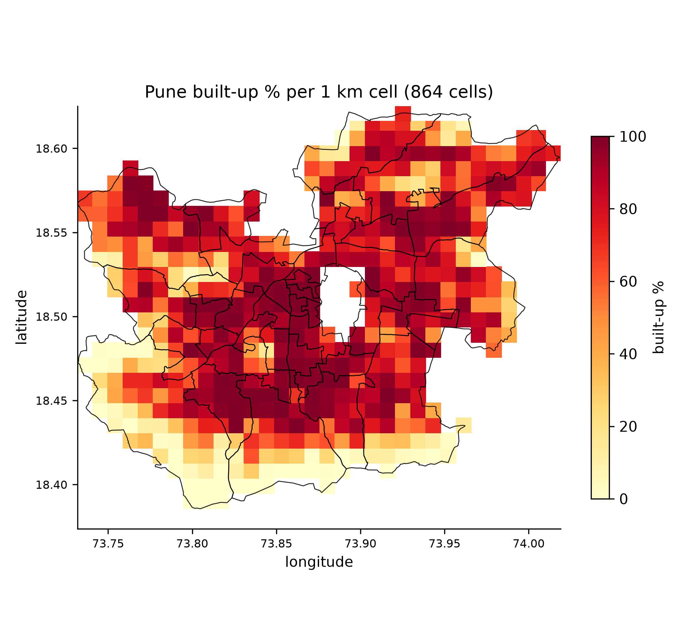
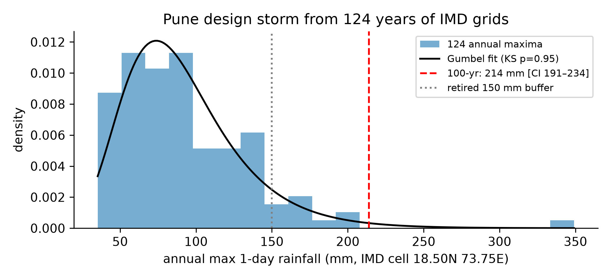
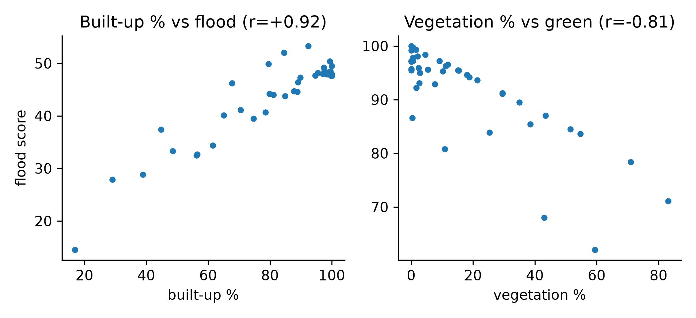
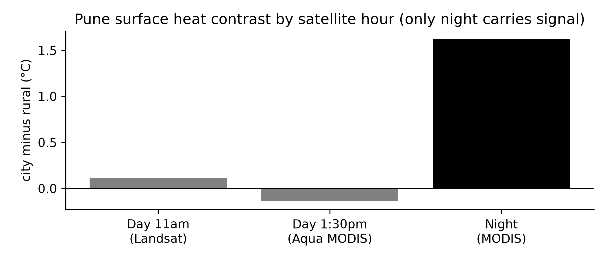
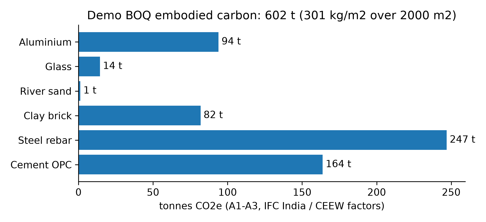
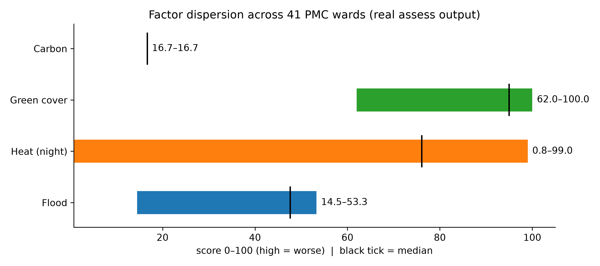

# Dishadharti — climate screening for building proposals in Pune

When a builder brings a development proposal to the municipal corporation,
no one can currently say what it will do to the city's climate: how much
rain it will shed as runoff, how much heat its concrete mass will hold,
how many trees it removes, how much carbon its materials carry. This
system answers those four questions with a score from 0 to 100
(high = worse), a plain-English explanation, and redesign conditions whose
effects are measured, not asserted.

Scope: Pune Municipal Corporation only — its real boundary, its 41 wards,
its 2019 tree census, its 2024 satellite record.

## How the system works

The work splits into two phases with very different costs.

**Phase 1 runs once, offline.** Satellites and census files are processed
into two baked artefacts:

- `epoch_cube.json` — Pune divided into 864 squares of about 1 km. Each
  square holds its 2024 land cover (built, vegetation, water, bare soil,
  tree canopy), day and night surface temperature, and elevation, all
  reduced server-side in Google Earth Engine.
- `tree_index.sqlite` — 4,009,623 census trees, deduplicated and
  spatially indexed, so any plot polygon can ask "which trees stand here"
  in seconds.

**Phase 2 runs per proposal, in about 10 seconds, with no internet.** The
officer pins the plot and enters built-up area, plot area, and a bill of
quantities. The pipeline looks up the square the plot sits in, reads its
numbers, walks the tree ledger for that exact polygon, and computes. A
language model then narrates the result. It reads the numbers aloud; it
never touches them.


*Takeaway: the dense urban core reads near 100% built-up; the southern
and western fringe near zero. Every flood score in this system comes out
of this partition.*

## The data we built

| artefact | what it is | size / count |
|---|---|---|
| epoch cube | 2024 land cover + temperatures + elevation, 864 cells | 864/864 cells complete |
| tree index | deduplicated 2019 census with spatial lookup | 4,009,623 trees |
| rainfall series | 124 annual 1-day maxima, IMD grids 1901–2024 | `imd_pune_annual_max.csv` |
| emission table | 38 materials, 102 name aliases, India factors | `materials.json` |
| species table | census-derived species data, audited against full index | `species.json` |

The land-cover partition was the hard part. An early version silently
dropped every water pixel (a class-label filtering bug), read vegetation
from the wrong sensor at half its true value, and spread classifier
uncertainty into phantom snow in a tropical city. All three were found by
measurement, fixed, and gated: the cube now refuses to build unless its
nine land classes sum to one in every cell. Water went from 0 to 258
cells; vegetation median rose 6.3% to 30.2%.

## Flood: stormwater runoff

**Method.** Standard SCS curve-number hydrology (NRCS TR-55): each surface
type carries a published runoff coefficient, the site's area-weighted
number is compared against a vegetated baseline, and the excess runoff at
the design storm becomes the score. Engineered drain proximity can only
ever lower the score; natural streams never count as drainage.

**The design storm is measured.** An early 150 mm placeholder was replaced
by fitting a Gumbel distribution to 124 years of IMD gridded rainfall at
the Pune cell: 100-year 1-day storm = 214 mm (fit quality p = 0.95,
interval 191–234). The 2005 peak in the series lands exactly on 26 July,
the Maharashtra flood day — the extraction is on the right cell.


*Takeaway: the old 150 mm sat between the 10- and 25-year storms. The
measured 100-year value is 214 mm. Larger storms shrink excess fractions,
so adopting it moved flood scores down, honestly.*

**Measured state.** Across 41 wards with identical test proposals:
14.5–53.3. Built-up share predicts flood at r = +0.92, vegetation cover
predicts it inversely at r = −0.95. Both directions correct, both strong.


*Takeaway: more concrete means more runoff; more vegetation means less.
The relationships are tight enough to trust and pointed the right way.*

## Heat: night-time stored warmth

**Method.** Night surface temperature of the site's square minus a rural
vegetated ring around the city, divided by the city's measured 5.0 C
span. The city averages +1.62 C above rural at night (independently
anchored: Yale's YCEO dataset sampled live at +1.139).

**Why night, not day.** Three separate measurements killed the daytime
factor. Mid-morning contrast is +0.11 C with the sign flipping by season.
Afternoon satellite coverage gives 3 usable scenes where 10 are needed.
Even 1:30pm peak-hour data shows −0.14 C — dry countryside soil out-heats
shaded city by day, a documented dryland effect. Afternoon danger is real,
but it lives in air temperature, not surface contrast, so the report says
so in words instead of faking a score.


*Takeaway: only the night column carries signal. The factor scores stored
heat release, labelled as such on every report.*

**Measured state.** 0.8–99.0 across wards — the widest spread of any
factor, driven by real night contrast.

## Green cover: trees kept versus trees lost

**Method.** Census canopy counts 70%, satellite ground vegetation 30%,
stratified so the same tree is never counted twice. Missing tree data
returns "unavailable," never a perfect score. Fellings carry
age-equivalent compensation as a range (162–441 saplings for a typical
assessment), never a single number, under the 1975 Trees Act as amended
in 2021. The 90 cm preservation rule is stated as house policy, not law.

**Measured state.** 62–100 across wards, r = −0.81 against vegetation.
The census total (4,009,623 indexed) matches the published 40,09,623
exactly. Independent satellite cross-check (GEDI LiDAR heights) found no
ward-level contradiction; one ward's overlapping crowns summing past 100%
is now labelled as a density index rather than a fraction.

## Carbon: the materials ledger

**Method.** Each bill-of-quantities line times its India-specific
cradle-to-gate factor: cement 0.91, steel rebar 2.6, brick 0.39 (IFC India
database), aluminium 20.88 (CEEW Indian smelter average). Result divided
by built-up area, scored against a 1200 scale, banded Low to Very High.
More than 10% unrecognised mass withholds the score instead of computing
on partial data. Anchors: IGBC near-net-zero at 700 kg/m2, observed
Indian high-rise mean 454.


*Takeaway: the demo bill totals 602 tonnes, steel first at 247 t.
The chart is also the audit trail — every bar multiplies out by hand.*

**Measured state.** Flat across wards for an identical bill, which is
correct: materials don't vary by location.
A 120-tonne-cement, 45-tonne-steel assessment hand-checks exactly to
226,200 kg at 75.4 kg/m2, band Low.

## The whole picture, per ward


*Takeaway: flood and green spread on real gradients, heat spreads widest
on night contrast, carbon is flat by design. Nothing is compressed into a
meaningless band.*

## What the system refuses to do

These are enforced in code and tests, not intentions:

- Score a factor from missing data (it drops out; weights redistribute).
- Let the narrator compute or adjust any number (prompt rules + tests;
  a live run once caught verdict-softening and it is now locked).
- Attribute an unsourced number to a standard (carbon bands, soil group
  and cost data stay labelled UNSOURCED).
- Train a neural scorer. One candidate model was trained for heat, failed
  its own bars, and ships nothing. Permit arithmetic stays exact.

## Running it

```bash
.venv/bin/python -m ml_pipeline.cli assess \
  --ward 12 --built-up 3000 --plot 8000 \
  --materials '[{"name":"cement_opc","quantityKg":120000}]' \
  --role municipal_authority --json-out /tmp/out.json

.venv/bin/python ml_pipeline/tests/test_scoring.py        # 48/48
.venv/bin/python ml_pipeline/tests/test_data_integrity.py # 8/8
.venv/bin/python ml_pipeline/tests/test_e2e_ward12.py
.venv/bin/python ml_pipeline/tests/test_narrative.py     # 22/22
.venv/bin/python engine/tests/test_engine.py             # 23/23
PYTHONPATH=. .venv/bin/python ml_pipeline/data/ward_sweep.py
```

Chatbot narration (key in `.env`, never in chat or git):

```bash
.venv/bin/python ml_pipeline/report/narrative.py /tmp/out.json \
  --role municipal_authority
```

## Reuse in another city

`engine/` scores any region supplying four things: a config file, a
satellite cube, a census index, ward polygons. The scorer holds no city
knowledge; a 23-test synthetic region proves the path. The contract is
documented in code (`engine/region.py`, `validate_config`).

## Known limits

1. Flood and heat score a ~1 km square, not the plot. Carbon and green
   are per-site.
2. Daytime surface heat carries no signal here; afternoons are described
   in words, not scored.
3. Carbon bands are house bands with sourced anchors, awaiting
   re-derivation.
4. A plausible-but-wrong input inside 0–100 is undetectable without a
   second source.
5. No trained model exists in this project, deliberately.

## Repository map

```
ml_pipeline/cli.py          entry point: assess | ward-profile | build-data
ml_pipeline/core/           scoring, canopy ledger, geometry, mitigations
ml_pipeline/intake/         input validation (shape, quantities, units)
ml_pipeline/report/         officer report + chatbot narrator
ml_pipeline/config/         pune, materials (India factors), species (audited)
ml_pipeline/data/           cube + tree index + measured evidence + methods
ml_pipeline/data/archive/   retired probes (nothing imports them)
ml_pipeline/tests/          the suites listed above
ml_pipeline/ui/             864-cell visual map (regenerate: build_map.py)
engine/                     any-region package + contract + self-tests
docs/                       this file's figures (regenerate: make_figures.py)
```
